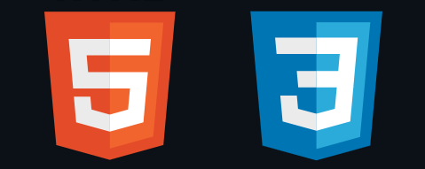
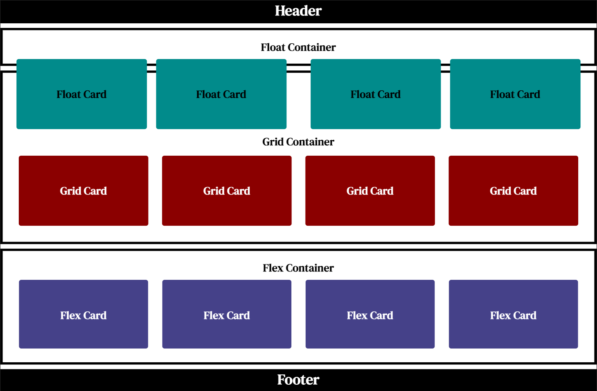
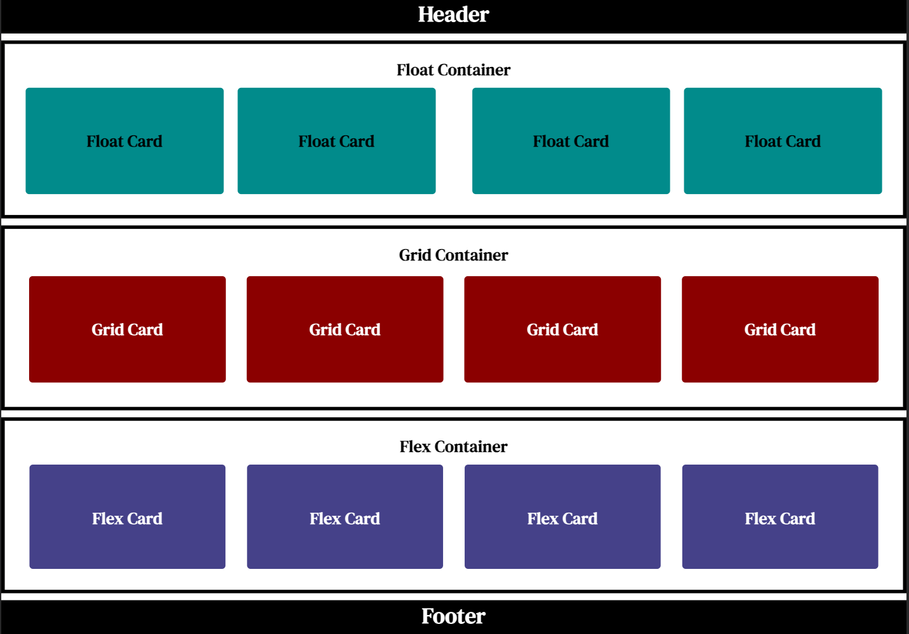
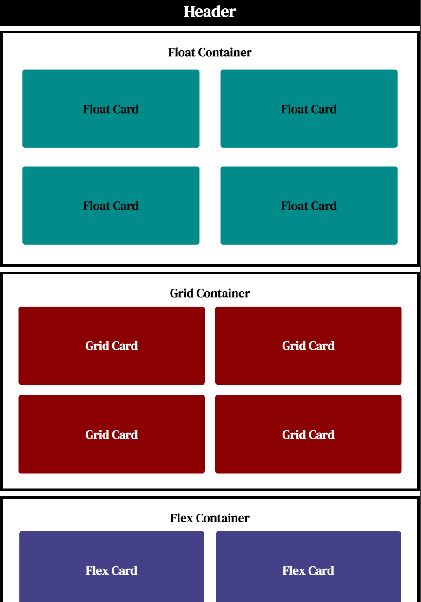
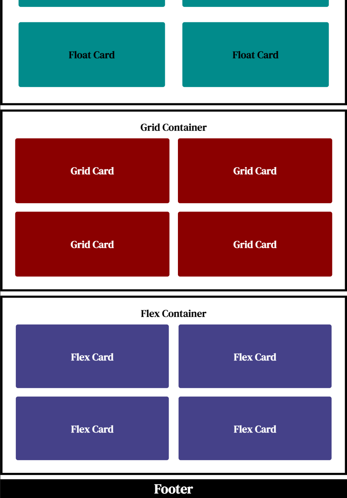
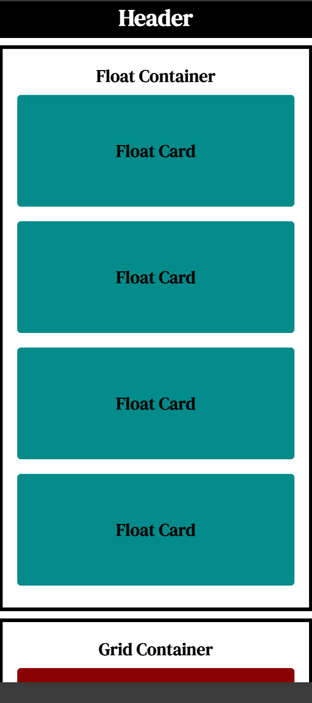
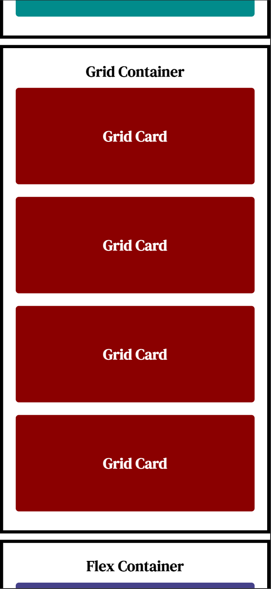
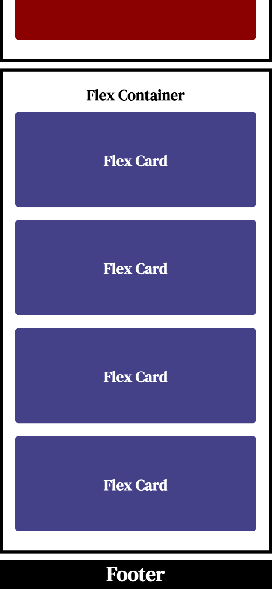

<a name="readme-top"></a>

<!-- PROJECT LOGO -->
<div align="center">
  <a href="">
    
  </a>
<h1 align="center">Containers & Responsive Design</h1>
<h4>Learn to build responsive layouts for mobile devices, tablets, laptops, and larger screens</h4>
</div>

<div align="center">
  <h3>
    <a href="#getting-started" target="_blank" rel="noreferrer noopener">Getting Started</a>
  </h3>
</div>

<!-- SCREENSHOT -->
<h2 align="center">Screenshots</h2>

<div align="center">
  
  
  <h2 align="center"></h2>
</div>
<div align="center">
  
  
  <h2 align="center"></h2>
</div>
<div align="center">
  
  
  
</div>

## Built With

[](https://html.com/html5/) [](https://www.w3schools.com/css/default.asp)

<!-- GETTING STARTED -->

## Getting Started

You can [download the project](https://github.com/RjayBrown/html-css-responsive-design/archive/refs/heads/main.zip) or fork and [run the project locally](https://github.com/RjayBrown/html-css-responsive-design#fork--run-locally) to get hands-on practice with the core concepts below. Start with reviewing the code and comments for each file in the practice folder.

### Core Concepts

- CSS - Selector Lists & Compound Selectors
- Containers - Floats, Grid & Flexbox
- Media Queries - Mobile First Development
- Inspect Tools - Viewing Layouts in the Browser

### Hands-On Practice

**1.** Try styling the elements to match the screenshots shown above.

**2.** Import a different font style from [Google Fonts](https://fonts.google.com/)

**3.** Try to double the number of cards in each container. You can use as many rows as you'd like for tablets, but make sure each container only has one row when viewed on a larger screen, and one column when viewed on a mobile device. Floats can be tricky to work with, so you can follow the resources here or use the hint in the comments to practice searching and applying a different solution!

## Build a Mini-Project

Once you complete the challenges you'll be able to use your new float, grid, and flexbox skills to build a fully responsive layout from scratch! Find a website you like and use the box model and your browser inspect tools to build a layout representing the home page (add text content too if you'd like!). The starter files are in the project folder.

If you run into trouble, you can reach out in the [[🕒 catchup-crew]](https://discord.com/channels/735923219315425401/932892279637700658) or [[❓code-help]](https://discord.com/channels/735923219315425401/735925942559440997) channels in the #100Devs Discord. It's an amazing community space filled with supportive developers happy to answer any questions you may have!

## Fork & Run Locally

**1.** To get started, open this [link](https://github.com/RjayBrown/html-css-responsive-design/fork) in a new tab to fork or make a personal copy of this repository

  - _**NOTE:** You may find it easier to keep the same name, but you can change it if you like!_

**2.** Click the code button to open the dropdown and copy the URL **(make sure HTTPS is selected)**.

**3.** Open the terminal in your editor, type 'git clone' and paste the URL **(the command should follow one of the formats below)**.

  ```
   git clone https://github.com/YOUR-GITHUB-USERNAME/html-css-responsive-design
  ```
  ```
   git clone https://github.com/YOUR-GITHUB-USERNAME/YOUR-REPOSITORY-NAME
  ```

**4.** Run the command **(Press Enter)**

**5.** Navigate to the project folder

   ```
   cd html-css-responsive-design
   ```
   ```
   cd YOUR-REPOSITORY-NAME
   ```

**Done!** You are now able to run the project locally.


<!-- ACKNOWLEDGEMENTS -->

## Acknowledgments

A big thanks to [#100Devs](https://discord.com/channels/735923219315425401/735925942559440997) for the community support, and [Leon Noel](https://github.com/leonnoel) for the project inspiration.

If you found some value here and would like to support, feel free to give the project a ⭐️!

### Additional Resources & Mini-Projects

- [HTML/CSS - Semantic Elements & Basic CSS Styles](https://github.com/RjayBrown/html-css-introduction)
- [HTML/CSS - Containers & Responsive Design](https://github.com/RjayBrown/html-css-responsive-design)
- [HTML/CSS - Forms & More CSS Styles](https://github.com/RjayBrown/html-css-forms-and-links)
- [JavaScript (Client-side) - The DOM(Introduction): User Interaction & Changing the DOM](https://github.com/RjayBrown/javascript-dom-intro)
- [JavaScript (Client-side) - Fetch API(Introduction): Promise Chains & Handling JSON](https://github.com/RjayBrown/javascript-fetch-json-data)
- [JavaScript (Client-side) - Fetch API(Advanced): Async/Await & Handling JSON](https://github.com/RjayBrown/war-the-card-game)
- [JavaScript (Server-side) - URL Endpoints with NodeJS(Introduction)](https://github.com/RjayBrown/olympics-search)
- [JavaScript (Full-Stack) - MVC Architecture(Introduction)](https://github.com/RjayBrown/hello-world)
- [JavaScript (Full-Stack) - MVC Architecture(Advanced): Authentication](https://github.com/RjayBrown/freelancr) - Coming Soon!
- [JavaScript (Full-Stack) - MVC Architecture(Advanced): PostgreSQL](https://github.com/RjayBrown/b-u-b) - Coming Soon!
- [JavaScript (Full-Stack) - MVC Architecture(Advanced): ReactJS](https://github.com/RjayBrown/) - Coming Soon!

<!-- LICENSE -->

## License

This project is distributed under the MIT License. [Click here for more information](LICENSE).

<p align="right">[<a href="#readme-top">back to top</a>]</p>
